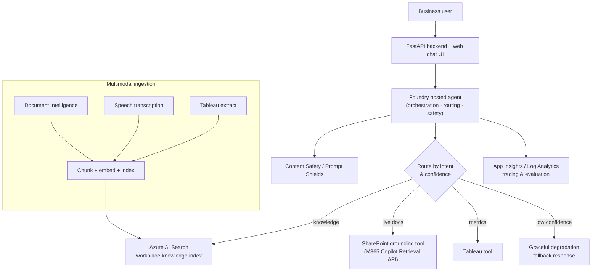

# Multimodal Workplace Chatbot on Microsoft Foundry

> A reference implementation of a modern, multimodal enterprise workplace
> chatbot built on **Microsoft Foundry** (Azure AI Foundry) — grounding on
> SharePoint, documents, audio/video, and structured Tableau data, with robust
> error handling, graceful degradation, and a business-focused evaluation
> harness.

<p align="left">
  
  
  
  
</p>

This repository prototype was produced for the **AI4Ops Enablement team** to evaluate
Microsoft Foundry across the full AI solution lifecycle — development, testing,
deployment, and hosting — using realistic enterprise grounding sources.

> **Sample-data disclaimer:** All scenarios, prompts, and any data in this repo
> are illustrative samples for a technical experiment. They do not represent
> real customer data, policies, or production configuration. Replace grounding
> sources and thresholds with your own before any production use.

---

## Highlights

- **Multi-source grounding** — a curated Azure AI Search lane (vector +
  semantic) for precise include/exclude control, plus a live SharePoint
  grounding lane via the Foundry SharePoint tool.
- **Truly multimodal ingestion** — text, documents (Document Intelligence),
  audio/video (Speech batch transcription), and structured data (Tableau).
- **Graceful degradation** — user-friendly fallbacks for unavailable sources,
  unanswerable queries, and low model confidence — never raw errors.
- **Business-focused evaluation** — a golden dataset and Foundry-built-in
  Evaluations harness with groundedness/relevance gates.
- **Production-minded landing zone** — Bicep IaC, RBAC-only (local auth
  disabled), managed identity, Key Vault, and full App Insights observability.

---

## Architecture



See [`docs/02-architecture.md`](docs/02-architecture.md) for the full,
architect-reviewed design (RAG topology, index schema, error-handling copy,
evaluation thresholds, governance, and network isolation).

---

## Repository map

| Path | What it is |
| --- | --- |
| [`docs/`](docs/) | Deliverables: [experiment spec](docs/01-experiment-spec.md), [architecture](docs/02-architecture.md), [project plan](docs/03-project-plan.md), and the guides below. Start at [`docs/README.md`](docs/README.md). |
| [`docs/DEPLOYMENT.md`](docs/DEPLOYMENT.md) | **Exact, verified Azure deployment steps.** |
| [`docs/CONFIGURATION.md`](docs/CONFIGURATION.md) | Environment-variable reference. |
| [`infra/`](infra/) | Bicep Infrastructure-as-Code for the Azure landing zone. |
| [`scripts/`](scripts/) | One-command deploy/teardown scripts (PowerShell + Bash). |
| [`src/`](src/) | Reference implementation: Foundry agent, multimodal ingestion, evaluation, API, frontend. |
| [`tests/`](tests/) | Unit tests for the pure-logic modules (run with no Azure dependency). |

---

## Quick start

### 1. Run the tests locally (no Azure required)

```powershell
python -m venv .venv
.\.venv\Scripts\Activate.ps1
pip install -r requirements.txt
pytest -q
```

The pure-logic modules — chunking, routing, confidence gating, and graceful
degradation — are fully implemented and unit-tested with no Azure dependency.

### 2. Deploy to Azure

One command (see [`docs/DEPLOYMENT.md`](docs/DEPLOYMENT.md) for prerequisites,
quota pre-checks, and troubleshooting):

```powershell
./scripts/deploy.ps1 -ResourceGroup rg-pgr-chatbot -Location eastus2
python -m src.ingestion.pipeline --ensure-index
```

Linux/macOS:

```bash
./scripts/deploy.sh -g rg-pgr-chatbot -l eastus2
python -m src.ingestion.pipeline --ensure-index
```

Then wire the Foundry connections/agent and run the API — see
[`docs/DEPLOYMENT.md §7`](docs/DEPLOYMENT.md).

---

## Architecture mapping

| Concept | Location |
| --- | --- |
| Hosted orchestrator agent | `src/agent/agent.py` |
| Model routing & confidence gating | `src/agent/routing.py` |
| Grounded retrieval (AI Search) | `src/agent/tools/search_tool.py` |
| SharePoint (Indexed) Knowledge Source | `src/ingestion/sharepoint_knowledge_source.py` |
| Structured/metrics lane (Tableau) | `src/agent/tools/tableau_tool.py` |
| Content Safety / Prompt Shields | `src/agent/safety.py` |
| Graceful degradation & fallbacks | `src/agent/degradation.py` |
| Multimodal ingestion | `src/ingestion/` |
| Index schema (ACL/modality/freshness) | `src/ingestion/indexer.py` |
| Foundry built-in Evaluations | `src/evaluation/evaluate.py` |
| Landing zone | `infra/` |

---

## Documentation

| Guide | Purpose |
| --- | --- |
| [Experiment spec](docs/01-experiment-spec.md) | Goals, scope, and acceptance criteria |
| [Architecture](docs/02-architecture.md) | Full technical design (architect-reviewed) |
| [Project plan](docs/03-project-plan.md) | Phased delivery plan |
| [Deployment guide](docs/DEPLOYMENT.md) | Verified, step-by-step Azure deployment |
| [Configuration reference](docs/CONFIGURATION.md) | Every environment variable explained |

---

## Contributing & security

See [CONTRIBUTING.md](CONTRIBUTING.md), [CODE_OF_CONDUCT.md](CODE_OF_CONDUCT.md),
and [SECURITY.md](SECURITY.md).

## License

Licensed under the [MIT License](LICENSE).
