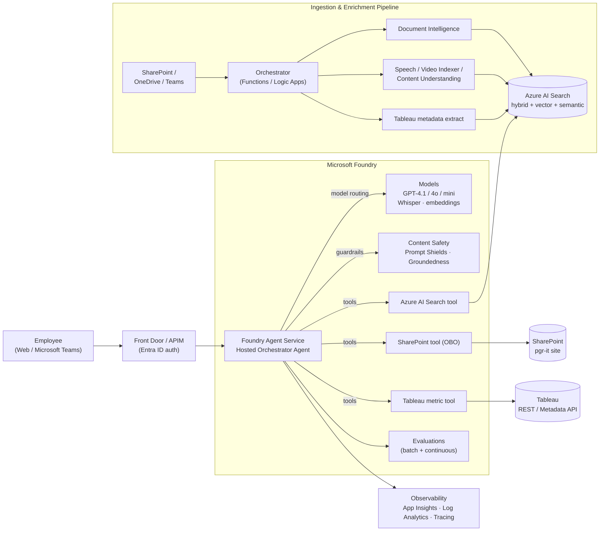
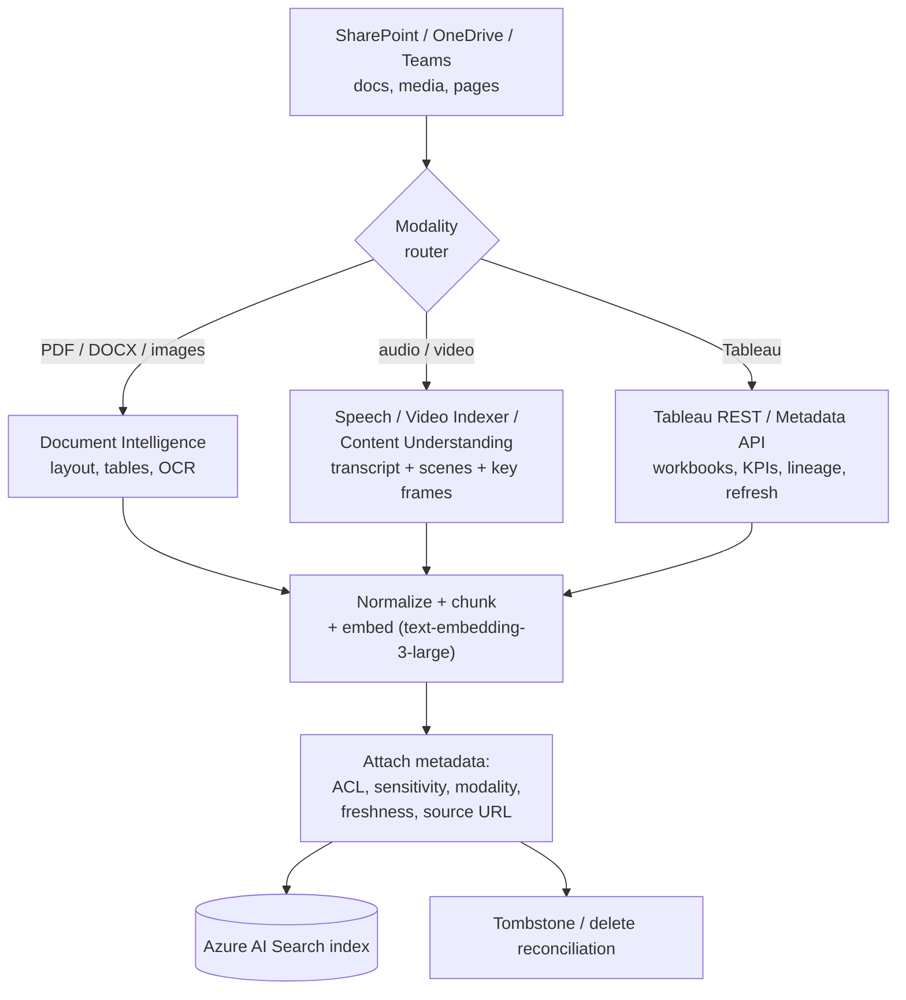
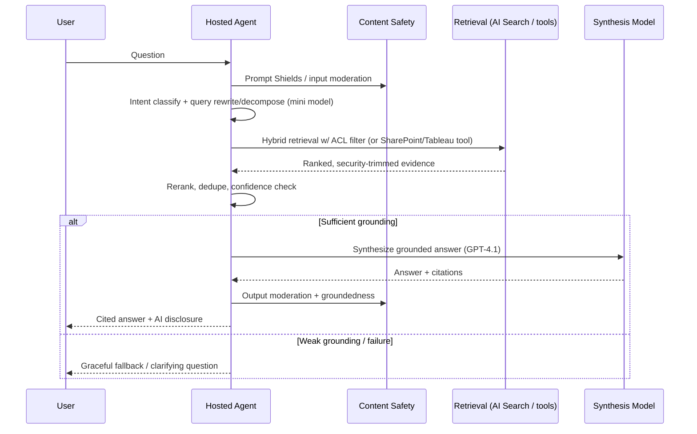
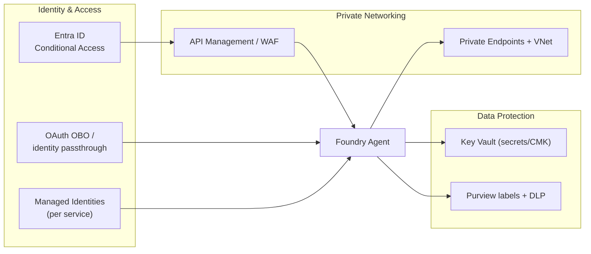
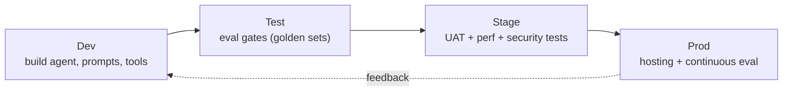

# Architecture Document — Multimodal Workplace Chatbot on Microsoft Foundry

| | |
|---|---|
| **Solution** | Modern Multimodal Workplace Chatbot |
| **Platform** | Microsoft Foundry (Azure AI Foundry) |
| **Owning Team** | AI4Ops Enablement — Your Enterprise |
| **Document Type** | Solution Architecture |
| **Status** | Reviewed & revised (Specialists → AI Architect → Cloud Solution Architect) |
| **Version** | 1.2 |
| **Companion Docs** | `01-experiment-spec.md`, `03-project-plan.md` |

> **Review provenance.** This architecture was drafted from a working session with three specialists — a Conversational AI / Agent Specialist, a Data & Knowledge Engineer, and a Security & Responsible AI Specialist — then reviewed and revised with an **AI Architect** and a **Cloud Solution Architect**. Their consolidated review notes are captured in **§13 Architecture Review Log**.

---

## 1. Architecture Goals & Principles

| Principle | Implication |
|---|---|
| **Grounded-first** | Answer only from retrieved/tool evidence for enterprise facts; always cite sources; abstain when evidence is weak. |
| **Identity-bound retrieval** | Users only ever see content they are entitled to (security trimming via identity passthrough). |
| **Private-by-default** | Private endpoints, VNet isolation, managed identities, no public data-plane exposure. |
| **Graceful degradation** | Every dependency failure has a defined, user-friendly fallback; never crash or leak raw errors. |
| **Measurable quality** | Foundry built-in Evaluations as release gates + continuous production evaluation. |
| **Lifecycle-complete** | IaC-driven build → test → deploy → host, promotable across environments. |
| **Right-sized models** | Model routing: small models for triage/rewrite, strong models for synthesis, modality models only when needed. |

## 2. Solution Overview

The solution is a **single primary Hosted Agent** running on **Foundry Agent Service**, specialized through **tools** rather than a multi-agent swarm (lower evaluation/governance complexity for the experiment; multi-agent is a documented Phase-2 option). The agent grounds answers on a **two-lane knowledge architecture**:

- **Curated lane** — a custom multimodal ingestion pipeline that normalizes SharePoint text, audio/video, and Tableau metadata into an **Azure AI Search** index (hybrid + vector + semantic ranking) for high-quality, tunable RAG.
- **Secure live lane** — the **Foundry SharePoint tool** (identity passthrough / OBO) for sensitive content classes where strict, real-time permission trimming matters more than enrichment.
- **Structured lane** — a **Tableau tool/API** for *live* metric questions (never compute numbers from retrieved text).

## 3. Logical Architecture & Components

| Layer | Component | Responsibility |
|---|---|---|
| **Experience** | Web app / Microsoft Teams | Chat UX, auth handoff, streaming, citations, feedback (thumbs/CSAT), AI-use disclosure |
| **Edge** | API Management / Front Door | Authn enforcement, rate limiting, WAF, request shaping, DLP policy hooks |
| **Orchestration** | Foundry Hosted Agent | Turn handling, modality detection, retrieval planning, model routing, citation enforcement, graceful degradation |
| **Reasoning** | Foundry / Azure OpenAI models | Triage/rewrite (mini), synthesis (GPT‑4.1), vision (GPT‑4o), speech (Whisper / gpt-audio), embeddings (text-embedding-3-large) |
| **Safety** | Azure AI Content Safety | Prompt Shields (direct + indirect injection), groundedness detection, protected material, output moderation |
| **Tools** | AI Search tool, SharePoint tool, Tableau tool, function/OpenAPI/MCP tools | Grounded retrieval, secure live lookup, live metrics, job-status/transcript lookups |
| **Knowledge** | Azure AI Search | Hybrid/vector/semantic index with ACL + modality + freshness metadata |
| **Ingestion** | Functions/Logic Apps + Document Intelligence + Speech/Video Indexer/Content Understanding | Multimodal extraction → normalized, security-trimmed chunks |
| **Data sources** | SharePoint (pgr-it), Tableau | Source of truth for documents, media, metrics |
| **Platform** | Entra ID, Key Vault, Private Endpoints/VNet, Azure Policy | Identity, secrets, network isolation, guardrails |
| **Operations** | App Insights, Log Analytics, Azure Monitor, Sentinel, Defender for Cloud | Tracing, metrics, security monitoring, alerting |

## 4. Multimodal Grounding & RAG Design

### 4.1 Two-lane (plus structured) grounding strategy

| Lane | When to use | Mechanism |
|---|---|---|
| **Curated RAG** (primary) | General knowledge, multimodal content, evaluation, tunable quality | Custom pipeline → Azure AI Search; agent uses **AI Search tool** |
| **Indexed SharePoint** | SharePoint sites needing folder/library scoping + doc-level permissions, without a custom pipeline | **SharePoint (Indexed) Knowledge Source** (agentic retrieval); `query` scopes folders, `ingestionPermissionOptions` carries ACLs (`src/ingestion/sharepoint_knowledge_source.py`) |
| **Secure live** | Highly sensitive content classes; strict real-time ACL | **Foundry SharePoint tool** with OBO identity passthrough |
| **Structured/metrics** | Live KPI values, aggregations, "current" numbers | **Tableau tool** (REST/Metadata API) via a middle-tier that enforces row/column security |

> The **Indexed SharePoint** lane (Azure AI Search `2026-05-01-preview`) is the
> answer to "can I restrict a set of folders/pages from ingestion?": scope
> ingestion to specific libraries/folders via the `query` parameter (include-only)
> and enforce document-level permissions at query time via
> `ingestionPermissionOptions`. See
> [Create a SharePoint (Indexed) Knowledge Source](https://learn.microsoft.com/azure/search/agentic-knowledge-source-how-to-sharepoint-indexed).

### 4.2 Multimodal ingestion pipeline

### 4.3 Chunking strategy by modality

| Modality | Chunking | Key metadata |
|---|---|---|
| Narrative docs | 600–1,000 tokens, 10–20% overlap | section heading, page range |
| Policies/procedures | By heading/section first | section title |
| Audio/video transcripts | Time-bounded semantic segments (30–90s / speaker/topic boundary) | timestamps, speaker, scene/topic |
| Tables / BI metadata | Small semantic records (not giant blobs) | KPI definition, owner, last refresh |

### 4.4 Index data model (Azure AI Search)

Core: `chunk_id`, `parent_doc_id`, `title`, `content`, `content_vector`, `source_system`, `source_url`, `modality`, `business_domain`, `language`, `confidence_score`.
Navigation: `section_heading`, `page_start/end`, `timestamp_start/end`, `speaker`, `keywords/entities`, `table_json`.
Freshness: `last_modified_utc`, `ingested_utc`, `source_etag`, `is_deleted`, `last_seen_utc`.
Security: `acl_users`, `acl_groups`, `sensitivity_label`, `pii_flag`, `tenant_id`.

Retrieval default: **`vector_semantic_hybrid`** (BM25 + vector + semantic ranker) with **query-time ACL filters** from the user's Entra claims.

### 4.5 Query pipeline

### 4.6 Structured data vs unstructured RAG

- **RAG** for "what does this dashboard mean", KPI glossary, ownership, lineage, narrative commentary, "summarize this video".
- **Tool call / NL-to-query** for "current value of metric X", "top 5 regions this month", "compare to last week". Metric answers always return **value + grain + time period + last-refresh timestamp + source workbook**. Never compute numbers from retrieved text.

## 5. Conversation Design

- **System prompt:** short core contract + runtime policies — answer only from evidence for enterprise facts; cite sources; distinguish *answer / partial answer / cannot verify*; never invent policy, metrics, or access rights.
- **Clarifying questions** only when ambiguous, sources conflict, or intent could be document-lookup vs live-KPI.
- **Low-confidence detection** is signal-based (not model self-report): weak/low-diversity retrieval, no high-quality citations, conflicting sources, tool failure/timeout, stale/empty structured result.
- **Transparency:** every grounded claim cites title + deep link + page/section or transcript timestamp; UI shows "This is an AI assistant; verify important information."

## 6. Error Handling & Graceful Degradation

| Failure | Behavior | Example fallback copy |
|---|---|---|
| Tool failure | Retry once → search-only answer | "I couldn't reach the live analytics source right now. I can answer from indexed documentation, but may miss the latest dashboard values." |
| Source unavailable | Use last indexed content within freshness SLA, else abstain | "The SharePoint source appears temporarily unavailable. I can try again, or use previously indexed content if that's acceptable." |
| Model timeout | Reduce context → switch to mini model → concise partial answer | (concise partial response) |
| Low confidence | Abstain or targeted clarification | "I found related content, but not enough evidence to answer confidently. Want me to narrow this to a specific policy, team, or date range?" |
| Unsupported / pending modality | Acknowledge, route to text-only | "This recording hasn't been fully processed yet. I can search available transcript segments, but coverage may be incomplete." |
| Identity passthrough fails | Refuse / narrow scope — **never** fall back to broad app permissions | "I can't confirm your access to that content right now, so I won't retrieve it." |

All paths produce a **trace** (request → retrieved sources → ACL filter applied → model/tool calls → moderation actions → fallback/refusal path) with **no raw system messages** exposed to the user.

## 7. Security Architecture

- **Identity:** Entra ID + Conditional Access; **OBO/identity passthrough** for user-context retrieval; **user-assigned managed identities** per component (frontend, agent runtime, ingestion, evaluation) for least privilege and traceability — no shared service principals.
- **Security trimming:** ACLs preserved at ingestion **and** enforced at query time; transcripts inherit the source recording's ACLs; Tableau access via a middle-tier enforcing row/column security per user.
- **Network:** private endpoints + VNet for Storage, Key Vault, AI Search, Monitor path; public data-plane access disabled; approved-region/data-zone model hosting for residency.
- **Data protection:** TLS 1.2+; encryption at rest; **CMK** for high-sensitivity stores; secrets in **Key Vault**; **Purview** sensitivity labels propagated into retrieval policy; **DLP** on prompts/outputs/exports; PII masked in logs/traces/eval datasets.
- **Sensitivity tiers:** separate indexes/partitions — general internal, restricted/confidential, highly-sensitive/live-only.

## 8. Responsible AI

Mapped to the **Microsoft Responsible AI Standard**:

| Pillar | Design implication |
|---|---|
| Fairness | Bias testing across business units, roles, accessibility, language register |
| Reliability & Safety | Grounding, refusals, eval gates, graceful degradation |
| Privacy & Security | OBO, security trimming, CMK, DLP, Key Vault, private networking |
| Inclusiveness | Accessible UX, multimodal support, understandable refusals |
| Transparency | AI disclosure, citations, source/freshness explanation |
| Accountability | Named owners, approval gates, audit trails, human escalation |

Controls: **Content Safety** (Prompt Shields for direct + indirect injection from grounding docs, groundedness detection, protected material), mandatory citations, refusal-over-speculation, human escalation for HR/legal/compliance/fraud edge cases, and a formal **RAI impact assessment** before production.

## 9. Evaluation Architecture

**Foundry built-in Evaluations first**, layered as release gates + continuous monitoring.

| Evaluator | Purpose | Suggested threshold |
|---|---|---|
| Groundedness | Answer supported by sources | ≥ 4.2 / 5 |
| Relevance | Answer addresses the query | ≥ 4.0 / 5 |
| Coherence / Fluency | Readability/quality | ≥ 4.3 / 5 |
| Retrieval | Right chunks retrieved | ≥ 90% pass |
| Tool Call Accuracy | Correct tool/structured query | ≥ 95% (structured scenarios) |
| Intent Resolution / Task Adherence | Agent did the right thing | tracked |
| Similarity | vs reference answers (where available) | tracked |

**Golden dataset** suites: policy lookup; procedure-from-video; KPI explanation; ambiguous→clarify; conflicting/stale sources; source/tool outage; permission-sensitive (negative authorization test). **Continuous evaluation** samples production traces; weekly review of failure clusters (grounded-but-incomplete, relevant-but-uncited, correct-intent/wrong-source, stale-analytics).

## 10. Lifecycle, Environments & DevOps

- **IaC** (Bicep / `azd`) for repeatable, promotable deployments; environment-specific config; no embedded secrets.
- **CI/CD** runs evaluation smoke + regression suites on each deploy; deployment blocked if eval thresholds or authorization-leakage tests fail.
- **Change control:** model swaps, prompt/tool changes, and new retrieval sources are governed configuration changes with approval + pre-prod eval gates.

## 11. Observability & Operations

- **Stack:** Application Insights + Log Analytics + Azure Monitor; full request/agent/tool tracing; **Sentinel** for security analytics; **Defender for Cloud** for posture.
- **Dashboards:** ungrounded-answer rate, prompt-shield hits, blocked outputs, retrieval authorization misses, latency/SLA, source-outage degradation, cost per scenario.
- **Alerts:** prompt-injection spikes, large-output/exfil patterns, failed OBO/auth-bypass attempts, anomalous tool usage, model regressions.

## 12. Risks & Mitigations (consolidated)

| # | Risk | Severity | Mitigation |
|---|---|---|---|
| 1 | Prompt injection from grounding documents | High | Prompt Shields, source allow-listing, instruction/data separation, suspicious-doc quarantine |
| 2 | Over-permissioned retrieval / broken security trimming | High | OBO, query-time ACL enforcement, negative authorization tests, no app-wide fallback |
| 3 | Hallucinated / ungrounded business guidance | High | Grounded-only prompts, mandatory citations, groundedness eval gate, refusal thresholds |
| 4 | Hallucinated structured-data answers | High | Live Tableau tool for metrics; never compute from text; return value+grain+refresh+source |
| 5 | Data exfiltration via prompts/outputs/tools | High | DLP, sensitivity-aware output controls, limited exports, egress restrictions, anomaly alerts |
| 6 | Stale/deleted content in index | Med | Event + scheduled reconciliation, ETag/version tracking, tombstones, delete propagation SLAs |
| 7 | Poor multimodal extraction/chunking | Med | Modality-specific chunking, confidence scoring, human-validated golden sets |
| 8 | Preview-feature limitations/change (SharePoint tool, multimodal) | Med | Validate early, document constraints, custom-RAG fallback |
| 9 | Latency / brittle orchestration | Med | Single-agent design, bounded toolset, model routing, partial-response fallbacks, timeout budgets |
| 10 | Cost / quota overrun | Med | Right-sized model routing, per-scenario cost tracking, caching |
| 11 | Regulatory / policy non-compliance | High | RAI assessment, auditability, approved-region deployment, retention controls, legal/compliance release gate |

## 13. Architecture Review Log

| Reviewer | Key recommendations incorporated |
|---|---|
| Conversational AI / Agent Specialist | Single Hosted Agent + tools (not multi-agent for phase 1); model routing; signal-based low-confidence; built-in evals + thresholds |
| Data & Knowledge Engineer | Two-lane grounding (curated AI Search + secure live SharePoint); modality-specific chunking; Tableau as operational data with live tool; freshness/tombstone sync; sensitivity-tiered indexes |
| Security & Responsible AI Specialist | Zero-trust, private-by-default; OBO + query-time security trimming + negative tests; CMK/DLP/Purview; RAI Standard mapping; Sentinel/Defender; release gates |
| **AI Architect** | *Verdict: Approve-with-changes.* Hard Tableau-vs-RAG routing rules; replace silent model downgrade with confidence-gated fallback; tighten retrieval specs (hierarchical retrieval, top-K/rerank-K, claim-level citation coverage); slice-aware eval thresholds; add ACL-aware caching, prompt/model versioning, feedback loop. *(detail §13.1)* |
| **Cloud Solution Architect** | *Verdict: Approve-with-changes.* Formal landing zone + hub-spoke/private DNS/egress; multi-region DR + model quota/PTU strategy; AI Search replica/partition sizing + queue-based ingestion; operationalized governance (Policy, PIM, tagging/showback); contain preview-feature risk behind GA fallbacks. *(detail §13.2)* |

### 13.1 AI Architect Review

**Verdict: Approve-with-changes.** "A strong Phase-1 enterprise agent architecture; the separation of curated RAG, live secure access, and structured metric retrieval is directionally correct. Main weaknesses are retrieval rigor, structured-routing guarantees, and evaluation specificity — all fixable without changing the core design."

Highest-priority findings (incorporated in §15):

| ID | Area | Recommendation |
|---|---|---|
| F3 | Model routing | Replace silent GPT‑4.1→mini downgrade with **confidence-gated** fallback; downgrade only for low-risk intents or high-confidence evidence, else partial/abstain/retry. |
| F4 | Context budget | Define per-turn budgets: retrieval top‑K, rerank‑K, max evidence tokens, citation token reserve, compression vs long-context mode. |
| F6/F7 | RAG quality | Add **hierarchical retrieval** (document→section→chunk) with parent-child linking; specify top‑K before/after rerank, dedupe rules, and retrieval metrics (Recall@K, nDCG, citation precision). |
| F8/F9 | Structured routing | **Hard ruleset**: any aggregation/trend/period-comparison/top-bottom/current-value query MUST call Tableau; on conflict, structured wins for numbers and the answer surfaces the discrepancy + refresh-time skew. |
| F10 | Hallucination | Enforce **claim-level citation coverage**; validate cited chunks were actually retrieved; abstain on coverage/conflict threshold failure. |
| F11 | Evaluation | Make thresholds **slice-aware**: structured tool-call accuracy ≈ **99%**, auth-negative failures **zero tolerance**, separate targets per scenario. |
| F14 | Missing controls | Add **ACL-aware caching**, bounded conversation memory, explicit feedback loop, prompt registry/versioning, model lifecycle/canary rollback. |

### 13.2 Cloud Solution Architect Review

**Verdict: Approve-with-changes.** "Directionally strong with good zero-trust intent and mature evaluation/safety/telemetry; but several critical platform decisions are implied rather than designed explicitly — landing zone topology, regional resilience, private networking/DNS, quota/capacity, and preview-feature containment."

Highest-priority findings (incorporated in §15):

| ID | WAF Pillar | Recommendation |
|---|---|---|
| F1 | Reliability/Security | Formal **enterprise landing zone**: separate prod/non-prod subscriptions, shared connectivity + security/logging subscriptions, policy-driven guardrails. |
| F2 | Security | Concrete network design: **hub-spoke**, Azure Firewall/NVA, UDRs, **private DNS zones** for Search/Key Vault/Storage/Monitor/OpenAI/Foundry, egress allowlists. |
| F3 | Reliability | **Paired-region** strategy with RTO/RPO; active-active vs warm-standby vs restore-only per component. |
| F4 | Reliability/Perf | AI Search **2–3 replicas** for SLA, partitioned for corpus/throughput; query/indexing isolation; tested rebuild runbook. |
| F5 | Reliability/Cost | Model capacity governance: **PTU** for steady latency-sensitive paths, **PAYG** for burst; reserve failover headroom; quota-exhaustion fallback. |
| F6 | Reliability/Perf | End-to-end **backpressure**: APIM quotas, concurrency caps, queue-based async ingestion, circuit breakers, jittered backoff for 429/5xx. |
| F13 | Reliability | **Queue/event-driven ingestion** with durable checkpoints, poison handling, replay, tombstone SLAs; separate extraction/enrichment/indexing stages. |
| F14/F16 | Compliance/Security | **Azure Policy** initiatives (private-only PaaS, CMK, mandatory diagnostics, approved SKUs/regions, tag enforcement); **contain preview features** behind feature flags with GA fallback paths. |

## 15. Review-Driven Revisions (incorporated)

The following revisions were adopted from the AI Architect and Cloud Solution Architect reviews and supersede/extend earlier sections:

**AI / agent layer**
- **Confidence-gated model fallback** (replaces unconditional downgrade): GPT‑4.1 synthesis is retained for high-risk/low-confidence answers; downgrade to mini only when intent is low-risk *and* retrieval confidence is high. Otherwise return partial, abstain, or retry.
- **Per-turn context budget policy**: bounded retrieval top‑K and rerank‑K, max evidence-token cap, reserved citation tokens; switch to compression/summary mode when over budget.
- **Hierarchical retrieval**: document → section → chunk with parent-child linking; video frame/scene evidence kept tied to timestamped transcript spans for citation fidelity.
- **Hard structured-routing classifier**: aggregation, trend, period comparison, top/bottom, filtering, or current-metric queries are *forced* to the Tableau tool. On structured-vs-unstructured conflict, the numeric structured source wins and the answer surfaces the discrepancy and refresh-time skew.
- **Claim-level citation enforcement**: each factual claim must map to a retrieved-and-cited chunk; cited chunks are validated against what was actually retrieved; abstain when citation coverage/conflict thresholds fail.
- **Added system controls**: ACL-aware semantic/result cache (keyed by user/ACL/context), bounded conversation memory with retention rules, thumbs-up/down + failure-label feedback loop, prompt registry/versioning, and model lifecycle (canary + rollback) policy.

**Evaluation**
- **Slice-aware thresholds**: structured-metric tool-call accuracy target raised to **≈ 99%**; permission/auth-negative failures held to **zero tolerance**; separate targets for policy lookup, multimodal, ambiguous, and outage slices. Add dataset versioning, judge calibration/human adjudication, adversarial/prompt-injection sets, and latency/cost SLO evaluation. Continuous eval explicitly targets security-, permission-, and structured-metric intents (not random sampling alone).

**Cloud / platform layer**
- **Enterprise landing zone**: separate prod/non-prod subscriptions, a shared connectivity subscription, and a shared security/logging subscription, under management-group policy guardrails.
- **Network design**: hub-spoke topology with Azure Firewall/NVA, UDRs, private DNS zones for AI Search, Key Vault, Storage, Monitor, Azure OpenAI/Foundry, and explicit egress allowlists; public data-plane access denied by Policy.
- **Resilience & DR**: paired primary/secondary regions with documented RTO/RPO; per-component active-active / warm-standby / restore-only classification; tested failover runbooks.
- **AI Search sizing**: ≥ 2 replicas (3 if query availability during maintenance is required), partitioned for corpus/throughput, query vs indexing load isolation, tested index-rebuild runbook.
- **Model capacity**: PTU for steady, latency-sensitive synthesis paths; PAYG for burst/experimentation; reserved failover headroom; automated fallback on quota exhaustion (429).
- **Backpressure & decoupled ingestion**: APIM quotas/concurrency caps, circuit breakers, jittered exponential backoff; **queue/event-driven ingestion** with durable checkpoints, poison-message handling, replay, and tombstone SLAs; extraction/enrichment/indexing stages scaled independently.
- **Operationalized governance**: Azure Policy initiatives (private-only PaaS, CMK where required, mandatory diagnostic settings, approved SKUs/regions, tag enforcement); RBAC matrix with PIM/JIT for admin roles; mandatory tagging (BU, app, env, data class, owner, cost center, scenario) with budgets/anomaly alerts and per-scenario showback; immutable audit-log retention for regulated evidence.
- **SRE-grade operations**: SLOs (latency, grounded-response rate, auth-trim correctness, tool availability) with error budgets, synthetic probes, alert severities, and incident playbooks for quota/model/source failures.
- **Preview-feature containment**: preview-dependent capabilities (e.g., Foundry SharePoint tool, multimodal grounding) isolated behind feature flags with **GA-only fallback paths**; no production-critical scenario depends solely on a preview feature.

## 14. Production Readiness Checklist (foundation)

- [ ] Entra ID + Conditional Access; OBO validated end-to-end
- [ ] Security-trimmed retrieval verified with negative tests
- [ ] Managed identities for all Azure service calls
- [ ] Private endpoints / VNet; public data-plane access disabled
- [ ] CMK / Key Vault / secret rotation
- [ ] Purview labels + DLP applied
- [ ] Content Safety, Prompt Shields, groundedness, protected material enabled
- [ ] Human escalation workflow defined; RAI impact assessment completed
- [ ] Threat model + red-team exercise completed
- [ ] Evaluation thresholds approved by business/security/compliance
- [ ] Full audit logging + retention
- [ ] Incident response runbook tested; DR validated (backup/restore, index rebuild, regional failover)
- [ ] Monitoring/alerting on abuse, leakage, outages, regressions
- [ ] Change approval board for model/prompt/tool/source updates
- [ ] Cost model + scaling plan documented
