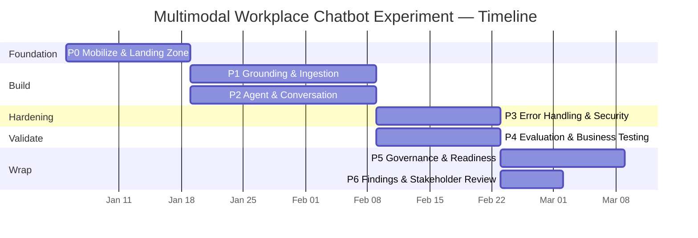

# Project Plan — Multimodal Workplace Chatbot Experiment on Microsoft Foundry

| | |
|---|---|
| **Project** | Multimodal Workplace Chatbot Experiment |
| **Platform** | Microsoft Foundry (Azure AI Foundry) |
| **Owning Team** | AI4Ops Enablement — Your Enterprise |
| **Document Type** | Project / Delivery Plan |
| **Status** | Draft for review |
| **Version** | 1.0 |
| **Companion Docs** | `01-experiment-spec.md`, `02-architecture.md` |

---

## 1. Objective & Approach

Deliver a working multimodal workplace chatbot on Microsoft Foundry that grounds answers on PGR-IT SharePoint content (text, audio/video, Tableau structured data), proving the full AI lifecycle (build → test → deploy → host), with robust error handling, a business-focused evaluation foundation, and a governance/production-readiness foundation.

**Approach:** time-boxed, iterative experiment delivered in six phases over ~10–12 weeks, with evaluation gates between phases and a stakeholder review at each milestone. Grounded-first, identity-bound, private-by-default, measurable-quality principles apply throughout (see `02-architecture.md`).

## 2. Workstreams

| WS | Workstream | Lead role |
|---|---|---|
| WS1 | Platform & Landing Zone (Azure, networking, identity, IaC) | Cloud / Platform Engineer |
| WS2 | Data & Knowledge (ingestion, multimodal, AI Search, Tableau) | Data / Knowledge Engineer |
| WS3 | Agent & Conversation (Foundry agent, prompts, tools, routing) | AI / Agent Engineer |
| WS4 | Security & Responsible AI (identity passthrough, RAI, governance) | Security & RAI Specialist |
| WS5 | Evaluation & Quality (scenarios, golden sets, Foundry Evaluations) | QA / Evaluation Lead |
| WS6 | Enablement & Stakeholders (demos, findings, recommendations) | AI4Ops Enablement Lead |

## 3. Phased Plan & Timeline

> Indicative durations; run as overlapping sprints. Each phase ends with an evaluation/review gate.

| Phase | Goal | Key activities | Exit criteria (gate) |
|---|---|---|---|
| **P0 — Mobilize & Landing Zone** (≈2 wks) | Foundation ready | Provision Foundry project; landing zone (subscriptions, hub-spoke, private DNS, Key Vault, managed identities) via IaC; access to SharePoint + Tableau; confirm model quota/region | Environments deploy from IaC; identity + private networking validated |
| **P1 — Grounding & Ingestion** (≈3 wks) | Multimodal knowledge layer | Build ingestion (Document Intelligence, Speech/Video Indexer/Content Understanding, Tableau metadata); AI Search index w/ ACL+modality+freshness; queue-based pipeline + tombstones | Text/audio/video/Tableau content indexed and retrievable with security trimming |
| **P2 — Agent & Conversation** (≈3 wks) | Working grounded agent | Foundry hosted agent; AI Search/SharePoint/Tableau tools; model routing; system prompt + citation enforcement; hard structured-routing rules | Agent answers BS‑1…BS‑4 with citations in dev |
| **P3 — Error Handling & Security** (≈2 wks) | Reliable & secure | Graceful degradation paths; Content Safety/Prompt Shields; OBO security trimming + negative auth tests; tracing/logging | No raw errors exposed; fallback copy validated; negative auth tests pass |
| **P4 — Evaluation & Business Testing** (≈2 wks) | Measured quality | Golden datasets; Foundry built-in Evaluations (groundedness/relevance/retrieval/tool-call); run BS‑1…BS‑7; record + analyze | Slice-aware thresholds met; results documented |
| **P5 — Governance & Readiness** (≈2 wks) | Production foundation | Governance considerations; RAI impact assessment; production-readiness checklist; cost/scaling notes | Checklist + governance doc reviewed with stakeholders |
| **P6 — Findings & Stakeholder Review** (≈1 wk) | Decision-ready | Consolidate Foundry limitations/observations; recommendations for enterprise rollout; final demo | Stakeholder review complete; go/no-go inputs delivered |

## 4. Milestones & Deliverables

| Milestone | Target | Deliverable | Maps to AC |
|---|---|---|---|
| M1 — Foundation ready | End P0 | Landing zone + Foundry project (IaC) | AC‑2 |
| M2 — Multimodal grounding | End P1 | Indexed SharePoint/Tableau multimodal content | AC‑1 |
| M3 — Grounded agent (dev) | End P2 | Working chatbot with citations | AC‑1, AC‑2 |
| M4 — Reliable & secure | End P3 | Error handling, degradation, security trimming, logging | AC‑3 |
| M5 — Evaluation results | End P4 | Foundry Evaluations results + analysis | AC‑4 |
| M6 — Readiness foundation | End P5 | Governance doc + production-readiness checklist | AC‑5 |
| M7 — Stakeholder review | End P6 | Findings, recommendations | AC‑2, AC‑4, AC‑5 |

## 5. RACI (summary)

| Activity | Sponsor | Enablement Lead | AI Eng | Data Eng | Cloud Eng | Sec/RAI | QA/Eval |
|---|---|---|---|---|---|---|---|
| Landing zone & IaC | I | A | C | C | R | C | I |
| Ingestion & AI Search | I | A | C | R | C | C | I |
| Agent & prompts | I | A | R | C | I | C | C |
| Error handling & security | I | A | C | C | C | R | C |
| Evaluation & testing | I | A | C | C | I | C | R |
| Governance & readiness | C | A | C | C | C | R | C |
| Stakeholder findings | A | R | C | C | C | C | C |

*R = Responsible, A = Accountable, C = Consulted, I = Informed.*

## 6. Resourcing

| Role | Allocation (experiment) |
|---|---|
| AI4Ops Enablement Lead | ~0.5 FTE |
| AI / Agent Engineer | 1 FTE |
| Data / Knowledge Engineer | 1 FTE |
| Cloud / Platform Engineer | ~0.5 FTE |
| Security & RAI Specialist | ~0.5 FTE |
| QA / Evaluation Lead | ~0.5 FTE |
| Business SMEs | As-needed (validation sessions) |

## 7. Dependencies

- Azure subscription + Foundry model quota in an approved region.
- Entra ID tenant, SharePoint (pgr-it) permissions, Tableau API access.
- Availability of business SMEs for answer validation.
- Availability/maturity of preview Foundry features (SharePoint tool, multimodal grounding) — with GA fallbacks.

## 8. Risks & Mitigations (delivery)

| Risk | Likelihood | Impact | Mitigation |
|---|---|---|---|
| Preview-feature gaps/changes | Med | Med | Validate in P0/P1; GA fallback (custom RAG); document constraints |
| Data access delays (SharePoint/Tableau) | Med | High | Secure access in P0; escalate via sponsor |
| Multimodal extraction quality | Med | Med | Confidence scoring; human-validated golden sets in P4 |
| Over-permissioned retrieval | Low | High | OBO + query-time trimming + negative tests (P3 gate) |
| Model quota/capacity limits | Med | Med | PTU reservation for steady paths; PAYG burst; quota alerts |
| Scope creep | Med | Med | Fixed phase gates; backlog parked for Phase-2 |
| SME availability | Med | Med | Schedule validation sessions early; async review option |

## 9. Evaluation & Quality Gates

- Evaluation runs at **P4** and continuously thereafter (see `02-architecture.md` §9, §15).
- **Gate to "demo-ready":** groundedness ≥ 4.2/5, relevance ≥ 4.0/5, retrieval ≥ 90% pass, structured tool-call accuracy ≈ 99%, **zero** permission/auth-negative failures.
- Findings and improvement recommendations documented and shared at **M5/M7**.

## 10. Communications & Governance

- **Weekly:** workstream stand-up + risk/issue log review.
- **Per milestone:** stakeholder demo + gate decision.
- **Change control:** model/prompt/tool/source changes are governed configuration changes with approval + pre-prod eval gates.
- **Final:** stakeholder review with Foundry limitations, recommendations, and enterprise-rollout inputs.

## 11. Definition of Done (experiment)

- [ ] All acceptance criteria (AC‑1…AC‑5) evidenced.
- [ ] Chatbot built, tested, deployed, and hosted on Microsoft Foundry.
- [ ] Multimodal grounding (text, audio/video, Tableau) demonstrated with citations and security trimming.
- [ ] Error handling, graceful degradation, logging/tracing in place.
- [ ] Foundry Evaluations executed; results analyzed; recommendations documented.
- [ ] Governance considerations + production-readiness checklist completed and reviewed.
- [ ] Foundry limitations/observations and enterprise-rollout recommendations presented to stakeholders.
