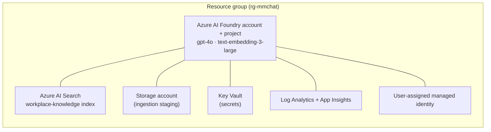

# Deployment Guide

This guide walks you through provisioning the **Multimodal Workplace Chatbot**
reference solution on Microsoft Foundry (Azure AI Foundry) from an empty
subscription to a working, queryable knowledge index.

Every command below was executed against a live Azure subscription while
authoring this guide. Where a step depends on customer-specific licensing
(Microsoft 365 Copilot for SharePoint grounding) or on the Foundry portal, it is
clearly marked **[Customer prerequisite]** so you can plan for it.

---

## 1. What you will deploy



| Resource | Purpose | Notes |
| --- | --- | --- |
| Azure AI Foundry account + project | Hosts the agent, models, and connections | `gpt-4o` (chat/vision) + `text-embedding-3-large` (embeddings) |
| Azure AI Search | Curated RAG lane (`workplace-knowledge` index) | Vector + semantic, 24 fields |
| Storage account | Ingestion staging for documents/media | Blob, RBAC-only |
| Key Vault | Tableau PAT and other secrets | RBAC-only |
| Log Analytics + App Insights | Tracing, logging, observability | Wired to the project |
| User-assigned managed identity | Runtime identity for the agent/API | Least-privilege RBAC |

All data-plane services deploy with **local authentication disabled**
(`disableLocalAuth = true`) — access is via Microsoft Entra RBAC only.

---

## 2. Prerequisites

| Requirement | Minimum | Check |
| --- | --- | --- |
| Azure subscription | Contributor + User Access Administrator on the target scope | `az account show` |
| Azure CLI | 2.60+ | `az version` |
| Bicep | 0.30+ (bundled with recent CLI) | `az bicep version` |
| Python | 3.11+ | `python --version` |
| PowerShell | 7+ (Windows) or Bash + `jq` (Linux/macOS) | `pwsh --version` |
| Model quota | GlobalStandard capacity for the chosen models | see §4 |
| **[Customer prerequisite]** Microsoft 365 Copilot license | Required only for the live SharePoint grounding lane | tenant admin |

> **Cost note:** The default footprint (Search `basic`, low model capacity) is a
> sandbox-scale deployment. Azure AI Search `basic` and the model capacity are
> the primary cost drivers. Tear down with `scripts/teardown.ps1` when finished.

Sign in and select your subscription:

```powershell
az login
az account set --subscription "<SUBSCRIPTION_ID_OR_NAME>"
```

---

## 3. One-command deployment

If your subscription has capacity for the defaults, this is the whole thing:

```powershell
# From the repo root
./scripts/deploy.ps1 -ResourceGroup rg-mmchat -Location eastus2
```

Linux/macOS:

```bash
./scripts/deploy.sh -g rg-mmchat -l eastus2
```

The script:

1. Confirms your Azure login.
2. Resolves your Entra **object id** from the ARM access token (avoids a Graph
   call that can fail with a Conditional-Access challenge — see §8).
3. Creates the resource group.
4. Runs the Bicep deployment in `infra/`, granting your identity the data-plane
   roles needed to create the index and agent.
5. Writes the deployment outputs to `.env` at the repo root.

Then create the search index (§6) and you are ready to ingest and query.

The remaining sections explain each step, the parameters, and how to recover
from the capacity/quota issues you are most likely to hit.

---

## 4. Pre-flight: model quota and Search capacity

The two most common deployment failures are **no model quota** and **Search
region out of capacity**. Check both before deploying to a new region.

**Model quota** (GlobalStandard, per region):

```powershell
az cognitiveservices usage list -l eastus2 `
  --query "[?contains(name.value,'GlobalStandard')].{model:name.value,limit:limit,used:currentValue}" -o table
```

**Available model versions** in a region:

```powershell
az cognitiveservices model list -l eastus2 `
  --query "[?kind=='OpenAI'].{model:model.name,version:model.version,sku:model.skus[0].name}" -o table
```

> **Verified gotchas** (captured while authoring this guide):
> - `gpt-4.1` GlobalStandard had **no quota** in the test subscription. The
>   defaults therefore use **`gpt-4o` (2024-11-20)**, which is broadly available.
> - `gpt-4o-mini` version `2024-07-18` is **deprecating** — you may be blocked
>   from creating new deployments of it. Pick a newer version or drop it.
> - Azure AI Search in `eastus2` returned `InsufficientResourcesAvailable`. The
>   defaults therefore place Search in **`eastus`** with the **`basic`** SKU via
>   the `searchLocation` / `searchSku` parameters. Move it back to your primary
>   region once capacity is available.

---

## 5. Manual deployment (equivalent to the script)

If you prefer to run the ARM/Bicep commands yourself:

```powershell
# 1. Resource group
az group create -n rg-mmchat -l eastus2

# 2. Your object id (from the token, not Graph)
$oid = (az account get-access-token --query accessToken -o tsv).Split('.')[1] |
  ForEach-Object {
    $p = $_.Replace('-','+').Replace('_','/')
    switch ($p.Length % 4) { 2 { $p += '==' } 3 { $p += '=' } }
    ([System.Text.Encoding]::UTF8.GetString([Convert]::FromBase64String($p)) |
      ConvertFrom-Json).oid
  }

# 3. Deploy
az deployment group create -g rg-mmchat -n mmchat-deploy `
  -f infra/main.bicep -p infra/main.parameters.json `
  -p location=eastus2 searchLocation=eastus searchSku=basic `
  -p privateByDefault=false deployerPrincipalId=$oid
```

Preview changes without deploying using **what-if**:

```powershell
az deployment group what-if -g rg-mmchat `
  -f infra/main.bicep -p infra/main.parameters.json -p deployerPrincipalId=$oid
```

### Parameters

| Parameter | Default | Description |
| --- | --- | --- |
| `baseName` | `mmchat` | Prefix for resource names |
| `location` | `eastus2` | Primary region for Foundry, Storage, Key Vault, monitoring |
| `searchLocation` | `eastus` | Region for Azure AI Search (split out for capacity) |
| `searchSku` | `basic` | Search SKU (`basic`, `standard`, …) |
| `privateByDefault` | `false` | `false` = publicly reachable sandbox; `true` = no public network access (production) |
| `deployerPrincipalId` | *(required)* | Object id granted data-plane roles for setup |
| `modelDeployments` | `gpt-4o`, `text-embedding-3-large` | Model deployments to create |

> **`privateByDefault`:** keep `false` for a sandbox you reach from your laptop.
> Set `true` for production — it disables public network access on the data
> services, after which you must reach them from inside the VNet / via private
> endpoints. See `docs/02-architecture.md` for the isolated topology.

---

## 6. Create the search index

The Bicep deployment provisions the Search **service**; the index schema is
created by the ingestion CLI (idempotent):

```powershell
# Load .env values into the session, then:
python -m pip install -r requirements.txt
python -m src.ingestion.pipeline --ensure-index
```

This creates the `workplace-knowledge` index (24 fields, vector + semantic
configuration). Re-running it is safe.

Ingest sample content:

```powershell
python -m src.ingestion.pipeline --source document --path ./data/samples
```

---

## 7. Foundry connections, agent, and API  **[Customer prerequisite]**

These steps depend on the Foundry portal and, for SharePoint, on Microsoft 365
Copilot licensing. They are intentionally separated from the verified
provisioning steps above.

1. **Azure AI Search connection** — In the Foundry portal, add a connection to
   the Search service and note its connection id → `.env` `SEARCH_CONNECTION_ID`.
2. **SharePoint grounding connection** *(optional, live lane)* — Requires a
   Microsoft 365 Copilot license and user-identity (OBO) auth in the **same
   tenant**. Scope it to one site or folder URL. See
   `docs/02-architecture.md §4` and the notes below.
3. **SharePoint (Indexed) Knowledge Source** *(optional, curated lane — folder
   scoping + doc-level permissions)* — Complete the [SharePoint indexer
   prerequisites](https://learn.microsoft.com/azure/search/search-how-to-index-sharepoint-online#prerequisites)
   (Entra app registration + connection string), grant the Search service's
   managed identity **Cognitive Services User** on the Foundry resource, set
   `SHAREPOINT_CONNECTION_STRING` (and optionally `SHAREPOINT_KS_QUERY` /
   `SHAREPOINT_INGESTION_PERMISSIONS`) in `.env`, then:
   ```powershell
   python -m src.ingestion.sharepoint_knowledge_source --print-payload   # review
   python -m src.ingestion.sharepoint_knowledge_source --create          # create source (auto-builds indexer pipeline)
   python -m src.ingestion.sharepoint_knowledge_source --status          # watch ingestion
   python -m src.ingestion.sharepoint_knowledge_source --create-knowledge-base
   ```
   This uses the `2026-05-01-preview` Search REST API (keyless / RBAC).
4. **Register / run the agent** — Use the config in `src/evaluation/agent_config.py`
   and the system prompt in `src/agent/prompts/system_prompt.md`.
5. **Run the API locally** against Azure:
   ```powershell
   uvicorn src.api.main:app --reload
   ```

> **SharePoint scoping reminder:** the Foundry SharePoint tool grounds **live**
> via the Microsoft 365 Copilot Retrieval API over the Microsoft Search index.
> Its scope is **include-only** by a single site/folder connection URL — there is
> no deny-list. For precise **folder/library include-only scoping** plus
> **document-level permission enforcement**, use the **SharePoint (Indexed)
> Knowledge Source** curated lane (step 3): `SHAREPOINT_KS_QUERY` scopes which
> libraries/folders are ingested and `SHAREPOINT_INGESTION_PERMISSIONS` carries
> SharePoint ACLs into query-time trimming.

---

## 8. Smoke tests

```powershell
# Search index exists and reports the expected field count
az search service show -g rg-mmchat -n <search-name> --query "name" -o tsv

# Model deployments are live
az cognitiveservices account deployment list -g rg-mmchat -n <foundry-account> `
  --query "[].{name:name,model:properties.model.name}" -o table

# Unit tests (no Azure required)
python -m pytest -q
```

---

## 9. Troubleshooting

| Symptom | Cause | Fix |
| --- | --- | --- |
| `InsufficientQuota` on model deploy | No GlobalStandard quota for the model in that region | Check with `az cognitiveservices usage list`; switch model/region or request quota |
| Cannot deploy `gpt-4o-mini` `2024-07-18` | Version is deprecating | Use a newer version or drop the deployment |
| `InsufficientResourcesAvailable` on Search | Region out of Search capacity | Set `searchLocation=eastus`, `searchSku=basic` (defaults) or another region |
| `az ad ...` fails with `TokenCreatedWithOutdatedPolicies` | Conditional-Access (CAE) challenge on Microsoft Graph | Don't call Graph — read the `oid` claim from an ARM access token (the scripts do this) |
| `403 AuthorizationFailed` creating index/agent | Data-plane RBAC not yet propagated | Wait 1–5 min after deploy; confirm `deployerPrincipalId` was passed |
| `ServiceDeleting` when recreating Search with same name | Prior soft-delete still finishing | Wait ~90s and retry, or use a new name |
| `PublicNetworkAccessDisabled` / connection timeout | `privateByDefault=true` and you're outside the VNet | Use `privateByDefault=false` for sandbox, or connect from inside the VNet |
| Purge blocked reusing a name | AI Services / Key Vault soft-deleted | `scripts/teardown.ps1 -Purge` |

---

## 10. Teardown

```powershell
# Delete the resource group (async)
./scripts/teardown.ps1 -ResourceGroup rg-mmchat

# Also purge soft-deleted Foundry account + Key Vault so the base name is reusable
./scripts/teardown.ps1 -ResourceGroup rg-mmchat -Purge
```

---

## 11. Verified deployment reference

The commands in this guide were validated against this live deployment:

| Item | Value |
| --- | --- |
| Resource group | `rg-mmchat` |
| Foundry account / project | `mmchat-aifoundry-*` / `mmchat-project` (eastus2) |
| Models | `gpt-4o` (2024-11-20, cap 30), `text-embedding-3-large` (v1, cap 50) |
| Search | `mmchat-search-*` (eastus, `basic`) |
| Index | `workplace-knowledge` (24 fields, vector + semantic) |
| Other | Storage, Key Vault, Log Analytics, App Insights, user-assigned identity |

See [`CONFIGURATION.md`](./CONFIGURATION.md) for the full environment-variable
reference.
