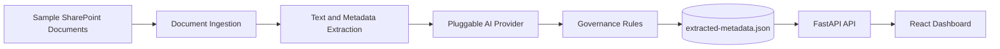

# Architecture

## Purpose

The SharePoint Knowledge Agent Transparency Dashboard MVP demonstrates how AI can improve governance for SharePoint knowledge content by automatically extracting metadata, generating summaries, assigning tags, identifying freshness gaps, and surfacing governance insights.

## Logical architecture

## Components

| Layer | MVP implementation | Production analogue |
|---|---|---|
| Data | `sample-documents` folder | SharePoint document libraries, Graph API |
| Extraction | Python OpenXML/PDF text extraction | Graph, Azure AI Document Intelligence, custom parsers |
| AI | Mock provider | Azure OpenAI or Azure AI Foundry model deployment |
| Governance | Freshness and risk rules | Purview, managed metadata, human review workflow |
| Storage | `data/extracted-metadata.json` | Azure Storage, Cosmos DB, Fabric/OneLake |
| API | FastAPI | Container Apps, App Service, AKS |
| UI | React/TypeScript + static demo | Enterprise dashboard or SharePoint-integrated app |

## Governance rules

- 0-180 days since last review: Current
- 181-365 days: Needs Review
- 365+ days: Stale
- High Risk if pricing, confidential, or regulated content is detected
- High Risk content is flagged as Human Review Required

## MVP boundaries

This is not production software. It intentionally uses local sample documents, deterministic mock AI, and JSON file storage so the demo can run quickly without credentials or external services.

