# Architecture

## Purpose

The Knowledge Metadata Agent MVP demonstrates automated extraction, summarization, tagging, and classification for a representative enterprise document library.

## Logical architecture

```mermaid
flowchart LR
    A[SharePoint or Local Documents] --> B[Document Ingestion]
    B --> C[Text and Metadata Extraction]
    C --> D[Pluggable AI Provider]
    D --> E[Structured Metadata Validation]
    E --> F[(extracted-metadata.json)]
    F --> G[FastAPI API]
    G --> H[Static Metadata Catalog]
    H --> I[Human Metadata Approval]
    I --> J[SharePoint Column Write-back]
    J --> K[Move Drive Item to Reviewed]
    L[SharePoint Staging Connector] --> D
    C --> L
```

## Components

| Layer | MVP implementation | Production analogue |
|---|---|---|
| Data | SharePoint document library through Graph, with `sample-documents` as the local staging folder | Direct SharePoint processing or event-driven ingestion |
| Extraction | Python OpenXML/PDF text extraction | Graph, Azure AI Document Intelligence, custom parsers |
| AI | Microsoft Foundry prompt or controlled-taxonomy classifier agent with mock fallback | Managed Foundry agent and model deployment |
| Metadata | Themes, tags, language, author, sentiment, category, lifecycle signals | SharePoint managed metadata or Purview taxonomy |
| Storage | `data/extracted-metadata.json` | Azure Storage, Cosmos DB, Fabric/OneLake |
| API | FastAPI | Container Apps, App Service, AKS |
| UI | Filterable static catalog served by FastAPI | Enterprise catalog or SharePoint-integrated app |
| Write-back | Explicitly enabled Graph staging upload, field updates, and move to `Reviewed` with ETag conflict detection | Governed SharePoint approval workflow |

## Metadata contract

- Concise summary
- Themes and suggested tags
- Language and explicitly identified author
- Sentiment, business area, audience, and metadata category
- Grounded review status, recorded approval status, and review recency
- Country of origin and user-requested custom metadata
- Field-level support, source evidence, and human review decisions for key metadata
- Application-generated link to the source demo document

The configured prompt agent produces the stable metadata contract. Dynamic country and custom-property extraction uses the project model named by `FOUNDRY_EXTRACTION_MODEL`, defaulting to `gpt-5-mini`. Explicit document labels take precedence over generated values.

Review status and recency are derived from an explicit `Last reviewed age days` field. Approval is populated only from an explicit `Approval status` field; otherwise it remains `Not Recorded`.

Metadata review is separate from document lifecycle status. The MVP projects review state onto legacy records, records accept/edit/reject decisions for business area, audience, language, author, and country of origin, and persists approved records to the local JSON store. When `SHAREPOINT_WRITEBACK_ENABLED=true`, approved mapped values are also written to SharePoint with ETag conflict protection and an audit record.

New catalog uploads are first placed in the configured SharePoint `Staging` folder. Approval updates configured internal column names and moves the same drive item to `Reviewed`. Drive-item and list-item ETags are tracked separately. An explicit retry refreshes both versions after a conflict; if metadata succeeds but the move fails, retry resumes at the move step instead of repeating the field update. Partially completed staging batches are removed from SharePoint before the local upload transaction is rolled back.

The inbound SharePoint connector lists supported files in `Staging` and imports only explicitly selected names. The server re-resolves those names in the configured folder, enforces the same file and batch limits as browser uploads, and preserves each existing drive-item identity. Imported files therefore enter the same human-review, metadata-write, and move-to-`Reviewed` workflow without creating a duplicate SharePoint item.

WTW classification is constrained to active terms generated from the supplied taxonomy. Each candidate includes confidence and source evidence. Uncertain, incomplete, internal-only, or otherwise risky classifications remain explicitly marked for human review.

## MVP boundaries

This is not production software. SharePoint files are staged locally and metadata is stored in JSON. Incremental synchronization, production workflow orchestration, and production storage are deferred beyond the MVP.
