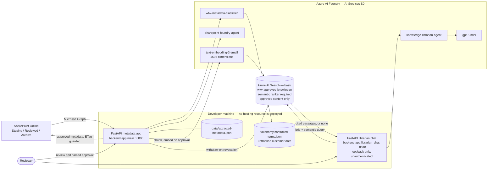
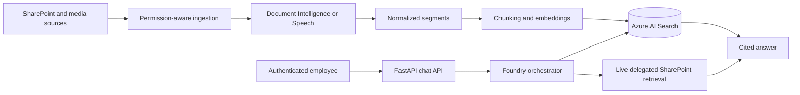
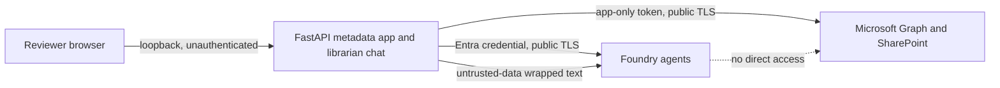

# Architecture

## Purpose

The Knowledge Metadata Agent MVP demonstrates automated extraction, summarization, tagging, and classification for a representative enterprise document library.

## Logical architecture

```mermaid
flowchart LR
    A[SharePoint or Local Documents] --> B[Document Ingestion]
    B --> C[Text and Metadata Extraction]
    C --> D[Pluggable AI Provider]
    D --> E[Structured Metadata Validation]
    E --> F[(extracted-metadata.json)]
    F --> G[FastAPI API]
    G --> H[Static Metadata Catalog]
    H --> I[Human Metadata Approval]
    I --> J[SharePoint Column Write-back]
    J --> K[Move Drive Item to Reviewed]
    L[SharePoint Staging Connector] --> D
    C --> L
```

## As-built deployment and Azure resources

The flow above is logical. This is what is actually deployed today, with the
concrete Azure resources each step uses. Setup instructions for all of it are in
[demo-setup.md](demo-setup.md).

```mermaid
flowchart LR
    SP["SharePoint Online<br/>Staging / Reviewed / Archive"]
    USER(["Reviewer"])

    subgraph local["Developer machine — no hosting resource is deployed"]
        direction TB
        API["FastAPI metadata app<br/>backend.app.main : 8000"]
        CHAT["FastAPI librarian chat<br/>backend.app.librarian_chat : 8010<br/>loopback only, unauthenticated"]
        JSON[("data/extracted-metadata.json")]
        TAX[("taxonomy/controlled-terms.json<br/>untracked customer data")]
    end

    subgraph foundry["Azure AI Foundry — AI Services S0"]
        direction TB
        CLS["wtw-metadata-classifier"]
        EXT["sharepoint-foundry-agent"]
        LIB["knowledge-librarian-agent"]
        EMB["text-embedding-3-small<br/>1536 dimensions"]
        GPT["gpt-5-mini"]
    end

    IDX[("Azure AI Search — basic<br/>wtw-approved-knowledge<br/>semantic ranker required<br/>approved content only")]

    SP -->|Microsoft Graph| API
    API --> CLS & EXT
    CLS --> TAX
    API --- JSON
    API -->|"chunk, embed on approval"| EMB
    EMB --> IDX
    API -->|"withdraw on revocation"| IDX
    API -->|"approved metadata, ETag guarded"| SP

    USER -->|"review and named approval"| API
    USER --> CHAT
    CHAT --> LIB
    LIB --> GPT
    CHAT -->|"hybrid + semantic query"| IDX
    IDX -->|"cited passages, or none"| CHAT
```

Points the diagram is making that are easy to miss:

- **Nothing hosts the application.** Both FastAPI processes run locally. The only
  deployed Azure resources are the Search service and the AI Services account;
  `infra/` declares the Search service and its two role assignments and nothing
  else.
- **The index holds approved content only.** Documents enter on approval and are
  withdrawn the moment approval is revoked, so the chat can only cite material a
  named human approved.
- **Writes never originate from a model.** The agents propose; the application
  executes against SharePoint with the plan-time ETag after a reviewer approves.
- **Three distinct agents**, which must not be collapsed into one.
- **Two regions.** Search is in East US and AI Services in East US 2 in the
  reference environment. They do not have to match.

| Resource | SKU / tier | Used for |
|---|---|---|
| Azure AI Search | basic, semantic ranker `free`, local auth disabled | Approved-content index and grounded retrieval |
| Azure AI Foundry (AI Services) | S0 | Hosts the three prompt agents |
| `gpt-5-mini` deployment | GlobalStandard | Classification, extraction, librarian reasoning |
| `text-embedding-3-small` deployment | Standard, 1536 dims | Chunk and query embeddings |
| SharePoint Online | — | Source library and write-back target |
| Entra app registration | — | Graph access, `Sites.Selected` |

## Components

| Layer | MVP implementation | Production analogue |
|---|---|---|
| Data | SharePoint document library through Graph, with `sample-documents` as the local staging folder | Direct SharePoint processing or event-driven ingestion |
| Extraction | Python OpenXML/PDF text extraction | Graph, Azure AI Document Intelligence, custom parsers |
| AI | Microsoft Foundry prompt or controlled-taxonomy classifier agent with mock fallback | Managed Foundry agent and model deployment |
| Metadata | Themes, tags, language, author, sentiment, category, lifecycle signals | SharePoint managed metadata or Purview taxonomy |
| Storage | `data/extracted-metadata.json` | Azure Storage, Cosmos DB, Fabric/OneLake |
| API | FastAPI | Container Apps, App Service, AKS |
| UI | Filterable static catalog served by FastAPI | Enterprise catalog or SharePoint-integrated app |
| Write-back | Explicitly enabled Graph staging upload, field updates, and move to `Reviewed` with ETag conflict detection | Governed SharePoint approval workflow |
| Taxonomy approval | Reviewer-editable controlled-vocabulary selections, mandatory classification-flag resolution, and approved taxonomy written to mapped columns | SharePoint managed metadata with term-store-bound columns |

## Metadata contract

- Concise summary
- Themes and suggested tags
- Language and explicitly identified author
- Sentiment, business area, audience, and metadata category
- Grounded review status, recorded approval status, and review recency
- Country of origin and user-requested custom metadata
- Field-level support, source evidence, and human review decisions for key metadata
- Application-generated link to the source demo document

The configured prompt agent produces the stable metadata contract. Dynamic country and custom-property extraction uses the project model named by `FOUNDRY_EXTRACTION_MODEL`, defaulting to `gpt-5-mini`. Explicit document labels take precedence over generated values.

Review status and recency are derived from an explicit `Last reviewed age days` field. Approval is populated only from an explicit `Approval status` field; otherwise it remains `Not Recorded`.

Metadata review is separate from document lifecycle status. The MVP projects review state onto legacy records, records accept/edit/reject decisions for business area, audience, language, author, and country of origin, and persists approved records to the local JSON store. When `SHAREPOINT_WRITEBACK_ENABLED=true`, approved mapped values are also written to SharePoint with ETag conflict protection and an audit record.

New catalog uploads are first placed in the configured SharePoint `Staging` folder. Approval updates configured internal column names and moves the same drive item to `Reviewed`. Drive-item and list-item ETags are tracked separately. An explicit retry refreshes both tokens after a conflict; if metadata succeeds but the move fails, retry resumes at the move step instead of repeating the field update. Partially completed staging batches are removed from SharePoint before the local upload transaction is rolled back.

For a possible revision, the app reads version history for a same-name item in `Reviewed` and displays it as a candidate; filename equality is not accepted as proof of identity. A human must explicitly select the replace-existing action and approve it with the metadata. Before replacement, the app rechecks the staged source and target ETags, replaces content on the existing drive item, applies approved metadata, and verifies SharePoint returned a version identifier different from the reviewed version. It records that actual version rather than predicting a number. Only after verification does it delete the staging source with its original ETag. A stale target requires renewed review; failed staging cleanup is reported while retaining the source.

The inbound SharePoint connector lists supported files in `Staging` and imports only explicitly selected names. The server re-resolves those names in the configured folder, enforces the same file and batch limits as browser uploads, and preserves each existing drive-item identity. Imported files therefore enter the same human-review, metadata-write, and move-to-`Reviewed` workflow without creating a duplicate SharePoint item.

WTW classification is constrained to active terms generated from the supplied taxonomy. Each candidate includes confidence and source evidence. Uncertain, incomplete, internal-only, or otherwise risky classifications remain explicitly marked for human review.

## MVP boundaries

This is not production software. SharePoint files are staged locally and metadata is stored in JSON. Incremental synchronization, production workflow orchestration, and production storage are deferred beyond the MVP.

## Initial demo position

The current implementation is a strong initial demo without the deferred retrieval and multimodal services. It demonstrates an end-to-end governed metadata workflow:

1. Ingest local files, browser uploads, or explicitly selected SharePoint `Staging` files.
2. Extract text from PDF, DOCX, and PPTX documents.
3. Classify content with a Microsoft Foundry agent constrained by the customer taxonomy.
4. Show confidence, evidence, risk flags, and field-level review support.
5. Let a reviewer accept, edit, reject, and approve metadata, including editing
   the controlled-taxonomy selections against the active vocabulary.
6. Require every classification flag to be resolved before approval is allowed.
7. Write approved mapped values, including taxonomy selections, to SharePoint
   with ETag conflict protection.
8. Move the same SharePoint item from `Staging` to `Reviewed`.

The initial implementation now also includes the first Azure AI Search retrieval slice: an idempotent approved-content index, chunking and embeddings, hybrid retrieval, and citation-shaped results. The full workplace-answering architecture remains a later phase because employee authentication, ACL projection, and grounded answer generation are not yet production-ready.

## Target architecture

```mermaid
flowchart LR
    A[SharePoint and media sources] --> B[Permission-aware ingestion]
    B --> C[Document Intelligence or Speech]
    C --> D[Normalized segments]
    D --> E[Chunking and embeddings]
    E --> F[(Azure AI Search)]
    U[Authenticated employee] --> G[FastAPI chat API]
    G --> H[Foundry orchestrator]
    H --> F
    H --> I[Live delegated SharePoint retrieval]
    F --> J[Cited answer]
    I --> J
```

The following sections capture the current implementation and remaining requirements for the three capabilities, followed by the network and trust boundaries that apply across all of them.

## 1. Azure AI Search, embeddings, hybrid retrieval, and citations

**Status: provisioned and connected.** The Search service, index, embeddings, and
the librarian's retrieval path are live. Employee authentication and ACL trimming
(section 2) remain outstanding, so the endpoint is not yet production-ready.

### Required Azure services

- Azure AI Search
- An approved embedding model deployment, configured by `FOUNDRY_EMBEDDING_MODEL` (the pilot defaults to `text-embedding-3-small`)
- Azure Storage for extracted text, normalized segments, and processing artifacts
- The existing Microsoft Foundry project and a model for grounded answer generation
- Managed identities and RBAC between the application, Search, Storage, and Foundry

The application principal needs two Search roles, not one:

- **Search Index Data Contributor** for indexing and querying documents.
- **Search Service Contributor** because the application calls
  `SearchIndexClient.create_or_update_index` at startup. Index schema management
  is not a document operation, so the data role alone returns 403 there.

`infra/modules/search-service.bicep` assigns both when `applicationPrincipalId`
is supplied, and provisions the service with semantic search enabled.

### Proposed search document

Each indexed chunk should include:

- Stable chunk and document identifiers
- Chunk text and embedding vector
- Document title, source URL, version, and last-modified time
- SharePoint site, drive, and item identifiers
- Page, slide, section, or timestamp provenance
- Approved business and taxonomy metadata
- Review and approval status
- Allowed user and group identifiers when indexed ACL filtering is selected

Search fields must be explicitly classified as searchable, filterable, facetable, sortable, retrievable, or vector fields. The embedding dimensions must match the selected model.

### Ingestion flow

1. Process only content allowed by the agreed publication policy, preferably approved content for the first pilot.
2. Extract a normalized document with source-positioned segments.
3. Split segments into retrieval-sized chunks while preserving headings and provenance.
4. Attach approved metadata and authorization data.
5. Generate embeddings.
6. Upload or merge chunks into Azure AI Search.
7. Record the source version or ETag used for indexing.
8. Remove obsolete chunks after a document is replaced, superseded, or deleted.

The existing approval workflow should trigger indexing after metadata and SharePoint write-back succeed. Indexing state must be separate from review state so failures are visible and retryable.

The current pilot exposes `POST /api/search/index` for explicit indexing and records `searchIndex.status` per document. A document is eligible only when `metadataReview.status` is `approved`; when SharePoint write-back is enabled, `sharePointWriteback.status` must also be `applied`. `POST /api/search/query` performs hybrid keyword/vector retrieval and returns citations, but does not yet generate a conversational answer.

### Query flow

1. Authenticate the employee.
2. Generate a query embedding.
3. Run hybrid keyword and vector search.
4. Apply metadata and authorization filters.
5. Apply semantic ranking when enabled.
6. Send only the best authorized chunks to the Foundry answer workflow.
7. Require citations to retrieved sources.
8. Return a clear no-answer response when authorized evidence is insufficient.

The current query endpoint enforces approved review status in the Search filter and returns an explicit no-evidence response. Employee authentication and ACL filtering are still required before exposing the endpoint to a production audience.

### Grounding the librarian, and why abstention needs the semantic ranker

The Knowledge Librarian chat routes a question to the approved index whenever it
looks like a knowledge question rather than a maintenance instruction. Triage
requests and metadata change requests deliberately bypass retrieval, so the
conversational maintenance path is unchanged.

Retrieval alone does not produce abstention. Hybrid search fuses keyword and
vector results with Reciprocal Rank Fusion, whose scores sit in a narrow band
(around 0.03) regardless of relevance: measured against the pilot index, a
question with no answer in the corpus scored 0.030 while a well-supported
question scored 0.033. Thresholding on that score is not possible.

The semantic reranker returns a 0-4 score that does separate the two cases. On
the same pair of questions the supported one scored 2.6-2.8 and the unsupported
one 1.60-1.66, so the pilot drops anything below `SEARCH_MIN_RERANKER_SCORE`
(default 1.9). When every hit falls below the threshold the librarian is
instructed to state that it found no approved evidence, and is explicitly
forbidden from answering from file names, folder listings, or model knowledge.

This makes semantic ranking a correctness requirement for the answer agent, not
an optional relevance improvement. `SEARCH_USE_SEMANTIC_RANKER` therefore
defaults to enabled, and the Search service must have semantic search turned on;
the Bicep template provisions it so a fresh deployment satisfies this by default.

A missing reranker score means relevance is unknown, not that the hit is good.
Returning unscored hits would let the librarian answer from evidence nobody has
judged, so retrieval raises instead and the chat degrades to its documented
"search unavailable" reply. Search failures are translated the same way, both at
the call and during result iteration, because the SDK returns a lazy pager that
can fail after the call appears to have succeeded.

A score of `0.0` is a real score and must not be confused with a missing one. It
is falsy, so reading the value with a truthiness fallback across the SDK's
snake_case and camelCase spellings turns a legitimate "this passage is
irrelevant" into "the ranker is unavailable". The two lead to different
user-visible outcomes -- a quiet abstention versus a reported search outage -- so
the fallback triggers only when the value is genuinely absent.

Two further constraints follow from live testing:

- Excerpt volume is capped (`MAX_EXCERPT_CHARS`, `MAX_EXCERPT_BUDGET`). Quoting
  five full chunks into one prompt tripped the Azure OpenAI jailbreak shield and
  produced a hard failure, even though each chunk passed individually.
- A content-filter rejection is reported to the user as a content-filter result,
  not as a connectivity error, so the message is actionable.

### Index lifecycle: withdrawal and supersession

Approval status is written into each chunk at index time and the query filter
trusts those frozen values, so index membership must be maintained actively.

- **Withdrawal.** When a document loses approval, its chunks are deleted rather
  than skipped. This happens at the moment approval is revoked — editing a
  reviewed field or resolving a classification flag both return a document to
  `needs-review` — and not only during a full re-index. Waiting for the next
  re-index would leave un-approved content citable in the meantime. A withdrawal
  that fails is recorded as `withdrawal-failed` on the document rather than
  passing silently.
- **Supersession.** Chunk ids are keyed on document name and chunk position, not
  version, so re-indexing a new version overwrites the previous one in place. An
  earlier version-keyed scheme made ids diverge, leaving old and new guidance in
  the index together, both flagged approved.
- **Shrinkage.** If a new version produces fewer chunks, the surplus tail is
  deleted using ids derived from the previously recorded chunk count.
- **Concurrent revocation.** Indexing chunks and embeds before it uploads, so it
  is slow enough for a reviewer to revoke approval mid-flight. The withdrawal
  then completes first and the in-flight upload restores citable chunks for
  content nobody approves. Indexing therefore captures an approval token before
  it starts -- review status, reviewer, review timestamp and write-back status --
  and re-checks it under the review lock before committing. A write whose token
  no longer matches is discarded and its chunks removed. Re-approval invalidates
  the token too: a second approval is a different snapshot even though both read
  `approved`.
- **Serialization.** The token guards the *status*, but not the Search calls
  themselves, and chunk ids are shared across approvals. Two lifecycle
  operations on one document therefore act on the same keys: a withdrawal can
  delete chunks a concurrent re-approval has just uploaded, and a discarded
  stale write can delete a newer approval's chunks. Every index, withdrawal and
  discard for a document runs under a per-document lifecycle lock held across
  the slow Search calls. The review lock cannot do this because it is released
  precisely while embedding and uploading. The lock is per document so unrelated
  reviews still proceed in parallel, and it is always acquired before the review
  lock, never after, so the two cannot deadlock.
- **Stale withdrawal decisions.** A withdrawal is requested from a snapshot taken
  before the review lock was released, so a re-approval may have landed since.
  Withdrawal re-reads current state inside the lifecycle lock and does nothing if
  the document is approved again, rather than deleting the new approval's chunks.

### Partial batch failures

Azure AI Search reports per-key failures inside the results of a batch call
rather than by raising. Counting every requested id as removed therefore recorded
a revocation as complete while the chunks were still in the index and still
citable, which is the exact failure the withdrawal path exists to prevent. Both
deletion and upload inspect each result and raise on any failure.

An upload is rolled back when it partially fails. Ids are position-keyed, so a
partial upload has already overwritten part of the previous version: the index
holds a mix of two versions, and no chunk count is recorded that a later
withdrawal could use. Removing what was written returns the index to a
consistent state and leaves the document to be re-indexed on retry.

Deletion never depends on querying for what to remove. Azure AI Search indexes
asynchronously, so a document written moments earlier is not yet returned by
search; a read-based purge silently missed chunks and could retain the wrong
version. Ids are computed instead, and they are deleted first: the query sweep
runs afterwards purely as a reconciliation backstop, so a sweep that fails
cannot prevent known chunks from being removed. Both behaviours are covered by
tests that simulate indexing lag and sweep failure.

Approving a document indexes that document immediately, so it becomes answerable
without a separate full-corpus pass. An indexing failure is reported on the
approval response and does not roll back an approval that already succeeded;
this includes permission, outage and timeout errors raised while preparing the
index, which are recorded as a failed index status rather than surfacing as a
failed approval.

A full re-index re-reads each document immediately before use and writes back
only that document's index status, under the same lock the review service uses.
Saving the catalog snapshot the run started from would discard any approval made
while the run was in progress.

Changing the chunk-id scheme orphans existing chunks, because the old ids are no
longer derivable. Purge the index and rebuild when the scheme changes.

### Required application work

- Search indexing and query services under `backend/app/services`
- Search, chat, index-status, and reindex API endpoints
- A chat or question-answering UI with citation cards
- Links that open the source document at the best available page, slide, section, or timestamp
- Indexing status, failure details, retry, and removal handling
- `azure-search-documents` and the selected embedding client

### Validation

- A representative question set with expected supporting documents
- Questions that must return no answer
- Permission-sensitive questions for users with different access
- Retrieval relevance and citation-correctness measurements
- Latency, throughput, and cost measurements
- Regression tests across model, prompt, chunking, and index-schema changes

### Decisions to review

- Whether only approved content is searchable
- Required index freshness
- Chunk size and overlap
- Search tier and regional placement
- Embedding and answer-generation models
- Metadata filters exposed to employees
- Treatment of deleted, expired, and superseded content
- Required no-answer and fallback behavior

## 2. Security trimming and delegated SharePoint retrieval

The current connector identity is suitable for controlled ingestion and write-back, but it is not an employee authorization mechanism. A production answer experience must never reveal document text, titles, URLs, metadata, or citations that the authenticated employee cannot access.

### Approach A: indexed ACL security trimming

During ingestion, project effective SharePoint access into each indexed document:

- Allowed Microsoft Entra user object IDs
- Allowed Entra group object IDs
- Resolved SharePoint group membership when required
- Site, library, folder, and unique item permissions

At query time, the backend obtains the current user's object ID and transitive groups and adds a server-controlled Azure AI Search filter. The browser must not be able to supply or override the authorization filter.

This approach provides fast hybrid and vector search, but requires reliable synchronization when permissions or group membership change.

### Approach B: live delegated retrieval

The employee signs in through Microsoft Entra ID, and the backend retrieves SharePoint content with that user's delegated authorization. This may use an on-behalf-of flow with Microsoft Graph or an approved Copilot Retrieval API integration.

This approach leaves authorization with SharePoint and reflects permission changes immediately, but it may have higher latency and different retrieval capabilities than Azure AI Search.

### Recommended pilot approach

Use a hybrid model:

- Azure AI Search for approved, curated knowledge with indexed ACLs
- Live delegated SharePoint retrieval for fresh or out-of-index content
- The existing `Sites.Selected` application connector only for governed ingestion and metadata write-back

The Foundry orchestrator can route curated knowledge questions to Search and fresh or document-specific requests to delegated SharePoint retrieval.

### Identity and authorization requirements

- Entra application registration for the employee-facing web application
- Authorization Code flow and backend token validation
- On-behalf-of configuration if the backend calls Microsoft Graph for the user
- Certificate, federated credential, or another approved credential instead of a long-lived production secret
- Secure token caching and session expiration
- Application roles such as `Employee`, `MetadataReviewer`, and `TaxonomyAdministrator`
- Role enforcement on review, approval, retry, upload, import, reindex, and taxonomy operations
- Audit identity derived from authenticated claims

### Security validation

- Anonymous requests are rejected.
- Employees cannot invoke reviewer or administrator operations.
- A user cannot retrieve another user's restricted content.
- Group membership grants the expected access.
- Revoked access stops retrieval within the agreed freshness window.
- Restricted titles, snippets, metadata, and URLs never appear in answers or citations.
- Browser input cannot override ACL filters.
- Service-principal ingestion permissions cannot be reused as employee retrieval permissions.

### Decisions to review

- Indexed ACL filtering, delegated retrieval, or both
- Whether unique item-level permissions are common
- Whether Entra groups, SharePoint groups, or both are authoritative
- Copilot Retrieval API availability and licensing
- Required application roles and approval boundaries
- ACL and group-membership freshness requirements
- Test users and sites needed for permission validation

## 3. Document Intelligence and Speech multimodal processing

Multimodal processing should extend the current extractors through a shared normalized contract rather than adding independent services that return unstructured strings.

### Normalized extraction contract

Every extractor should return:

- Source identity, content type, and version
- Normalized full text
- Ordered segments
- Page, slide, section, or timestamp location
- Extraction confidence
- Structural role such as heading, paragraph, table, or transcript utterance
- Tables and other structured content when available
- Extraction diagnostics and warnings

The same contract feeds metadata classification, chunking, embeddings, Search indexing, citations, and human evidence review.

### Document Intelligence requirements

- Azure AI Document Intelligence resource
- Python SDK and managed-identity or approved credential access
- `prebuilt-layout` for the initial pilot to extract OCR text, paragraphs, tables, and page structure
- Initial support for native and scanned PDFs, PNG, JPEG, and TIFF
- Continued DOCX and PPTX extraction through the existing OpenXML path, normalized to the shared segment contract
- Page-level provenance and OCR confidence
- Explicit states for unsupported, corrupt, password-protected, empty, oversized, throttled, timed-out, and low-confidence documents

### Speech requirements

- Azure AI Speech resource
- Batch transcription for uploaded audio and video
- Azure Storage for media accessible to the transcription job
- Initial support for WAV, MP3, M4A, and the audio track from MP4
- Timestamped transcription segments
- Language configuration or detection
- Optional speaker diarization
- Customer vocabulary or phrase lists for domain terminology
- Processing job state, polling or event completion, retry, and failure reporting

### Required workflow and UI changes

- Asynchronous background processing and durable job state
- Idempotent processing and retry with backoff
- Page-count, file-size, and media-duration limits
- Dead-letter or operations queue for unrecoverable failures
- Malware scanning and content-type verification before processing
- Retention policy for originals, temporary media, extracted text, and transcripts
- UI processing status, warnings, confidence, and retry actions
- Evidence links that open the relevant page, slide, or media timestamp

### Validation

- Representative native and scanned PDFs
- Images with business content
- Representative audio and video in required languages and accents
- OCR and transcription accuracy thresholds
- Table extraction and citation-position tests
- Speaker and timestamp validation when diarization is enabled
- Cost and latency measurements by page and media minute
- Sensitive-information and data-residency review

### Decisions to review

- Initial file and media types
- Maximum pages, file sizes, and recording duration
- Languages, accents, and domain vocabulary
- Whether diarization is required
- Accuracy thresholds and human-review rules
- Storage location, retention, and deletion policy
- Whether sensitive media may be processed by the selected Azure services

## 4. Network boundaries and private connectivity

A recurring review question is whether the Foundry agents reach SharePoint over private networking. They do not, and the framing itself does not match the design: **the Foundry agents never connect to SharePoint at all.**

No agent in this solution has a SharePoint tool binding. The backend reads Microsoft Graph with its own identity, then passes the results into the prompt as inert text wrapped by `backend/app/services/chat_guardrails.py` as `<tag trust="untrusted-data">`. Every SharePoint call originates from the application, never from the model. There is therefore no agent-to-SharePoint network link to isolate; the links that exist are application-to-service.

### Current network posture

All traffic today traverses public service endpoints and is secured by tokens and tenant controls rather than network isolation.

| Hop | Endpoint | Transport | Authentication |
|---|---|---|---|
| Application to SharePoint | `https://graph.microsoft.com/v1.0` (`GRAPH_ROOT` in `backend/app/services/sharepoint.py`) | Public internet, TLS | App-only client credentials, `Sites.Selected` |
| Application to Foundry | `FOUNDRY_PROJECT_ENDPOINT`, `https://<resource>.services.ai.azure.com` | Public internet, TLS | Entra credential, currently developer sign-in |
| Application to Azure AI Search | Search service endpoint | Public internet, TLS | Managed identity or key; service is not yet provisioned |
| Reviewer browser to metadata app | FastAPI on the local host | Loopback | None |
| Reviewer browser to librarian chat | FastAPI on local port `8010` | Loopback | None |

`infra/modules/search-service.bicep` sets `publicNetworkAccess: 'enabled'`. The `infra` directory declares no virtual network, subnet, private endpoint, private DNS zone, or service firewall rule.

### Trust boundaries

```mermaid
flowchart LR
    R[Reviewer browser] -->|loopback, unauthenticated| A[FastAPI metadata app and librarian chat]
    A -->|app-only token, public TLS| G[Microsoft Graph and SharePoint]
    A -->|Entra credential, public TLS| F[Foundry agents]
    A -->|untrusted-data wrapped text| F
    F -.->|no direct access| G
```

The boundary that carries the most risk is not a network hop. It is the identity boundary at the application: the librarian chat reads with the application identity, so any caller who reaches port `8010` can see the entire library regardless of that person's own SharePoint rights, and it trusts the reviewer name a caller supplies, so a caller can also record an approval under someone else's name. Private networking would not change this. Delegated, on-behalf-of authorization is the control that does, and it is specified in section 2.

Until that lands, the librarian chat refuses any caller whose address is not loopback and reports `callerAuthentication: none` on its health endpoint. This is a containment measure, not a fix: it keeps an unauthenticated service from being reachable by accident, but it grants no per-user authorization. An operator can accept the risk deliberately in an isolated environment by setting `LIBRARIAN_CHAT_ALLOW_REMOTE_UNAUTHENTICATED=true`, which is intentionally explicit rather than a host binding that is easy to change without noticing.

### What can and cannot be privatized

- **Foundry supports private connectivity.** The project and model endpoints can be placed behind private endpoints with virtual-network injection, so the application-to-Foundry hop is genuinely privatizable once the application runs in Azure rather than on a workstation.
- **Azure AI Search supports private endpoints.** `publicNetworkAccess` can be set to `disabled` with a private endpoint and private DNS zone, at the cost of requiring the indexer and application to run inside the same network.
- **Microsoft Graph is the constraint.** Graph does not offer general-purpose Private Link for SharePoint content access, so this hop realistically remains on public service endpoints. Isolation for that hop is achieved through tenant and identity controls instead: `Sites.Selected` scoped to the pilot site, Conditional Access, named-location or IP restrictions on the service principal, certificate or federated credentials in place of long-lived secrets, and tenant restrictions.

Confirm the current Microsoft 365 and Graph private-connectivity options with the customer's network team before committing to a position. This document states the repository's posture, not a tenant capability assessment.

### Required work to reach a private posture

1. Host the application in Azure, for example Container Apps or App Service with virtual-network integration, since private endpoints cannot serve a workstation process.
2. Add a virtual network, subnets, private DNS zones, and private endpoints for Foundry and Azure AI Search.
3. Set `publicNetworkAccess` to `disabled` on Azure AI Search and restrict the Foundry project to the private endpoint.
4. Replace developer sign-in with a managed identity for all Azure service calls.
5. Place the reviewer-facing application behind Entra authentication and, where required, Application Gateway or Front Door with a web application firewall.
6. Apply Conditional Access and credential hardening to the Graph connector, which stays on public endpoints.
7. Route egress through the virtual network so Graph traffic leaves from a known, attestable address range.

### Decisions to review

- Whether the pilot must demonstrate private connectivity or only document the path to it
- Which hosting platform the application will use, since this determines virtual-network integration
- Whether the customer requires Azure AI Search to be unreachable from public networks
- Whether Conditional Access and IP restrictions on the Graph connector satisfy the isolation requirement
- Who owns the virtual network, private DNS zones, and firewall rules
- Whether egress must be forced through a customer-managed network path

## Proposed implementation sequence

1. Establish Entra authentication, application roles, and the authorization strategy.
2. Define the normalized document and segment contract.
3. Build approved-content chunking, embeddings, Azure AI Search, and citations.
4. Implement and validate indexed ACL filtering.
5. Add live delegated SharePoint retrieval where freshness or non-indexed access requires it.
6. Add Document Intelligence for scanned PDFs and images.
7. Add Speech only after search, authorization, citations, and asynchronous processing are proven.
8. Move hosting into Azure and apply the private-connectivity work in section 4 before any non-pilot deployment.

## Minimum credible pilot

The first post-demo pilot should intentionally limit scope:

- One SharePoint site and document library
- Two or more users with different permissions
- Approved-content-only indexing
- Azure AI Search hybrid retrieval
- PDF, DOCX, PPTX, and scanned PDF support
- Page- or slide-level citations
- No audio or video in the first pilot
- A 30-50 question evaluation set
- The existing metadata review and SharePoint write-back workflow

Audio and video transcription can follow once the authorization and cited document-answering path is validated.
